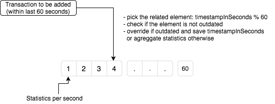

**Building**

1. Build

        mvn clean install

2. Start application

        mvn spring-boot:run

3. Go to http://localhost:9080/ and try out some requests with Swagger UI

****
**Description**

As a solution for statistics I have decided to use array of statistics per each second. In our case it is the array of 60 elements.
When we add a transaction which has a timestamp within last 60 sec, then statistics of this transaction is taken and added to the related element of the array. If this element of the array is already outdated then we override it and save the transaction's timestamp, otherwise we aggregate all statistics.

During fetching statistics for the last 60 seconds we just iterate through this array, check if element's timestamp is still within last 60 seconds and aggregate relevant statistics for each second.
That means that it will be executed in constant time and memory O(1).

**Another possible solution**

I also thought about having some scheduler which will calculate statistics every second based on added transactions and remove outdated transactions. But that means we need to store all transactions (more memory is needed) and calculate every second even if statistics is called quite rare.
